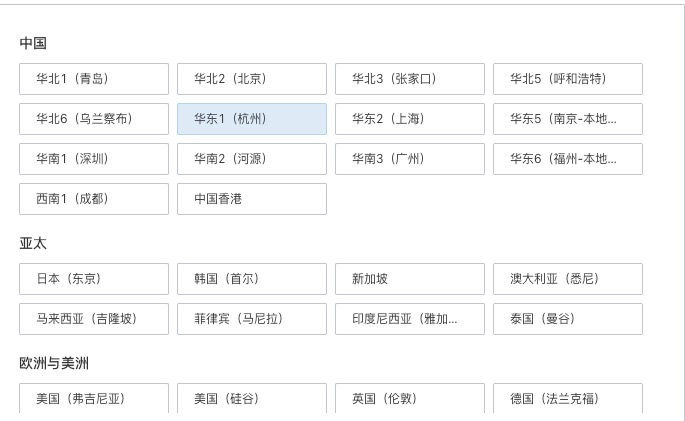
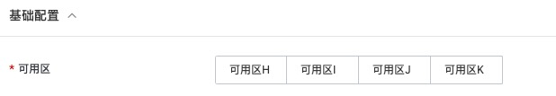
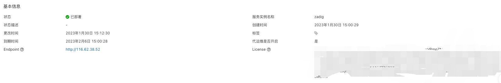
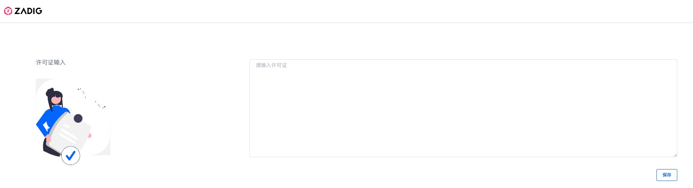
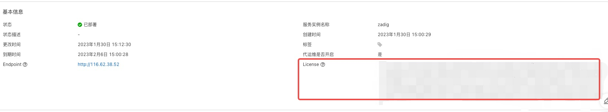

DevOps 平台 Zadig 实例部署文档
=====================================

>**免责声明：**本文档可能包含第三方产品信息，该信息仅供参考。阿里云对第三方产品的性能、可靠性以及操作可能带来的潜在影响，不做任何暗示或其他形式的承诺。

概述
-----------------------

Zadig 是目前落地最为广泛的企业级云原生一体化 DevOps 价值链平台。Zadig 具备灵活易用的高并发工作流、面向开发者的云原生环境、高效协同的测试管理、强大免运维的模板库、客观精确的效能洞察以及云原生 IDE 插件以及发布编排工作流、客户中心等重要特性，为工程师提供统一的协作平面。Zadig 内置了 K8s YAML、Helm Chart、主机等复杂场景 最佳实践，适用云原生转型/上容器云、研发效能提升、大规模微服务环境治理、研发数字化转型等应用场景。在企业服务、数字化转型、新能源汽车领域数百家企业深入使用。[视频地址](https://v.qq.com/x/page/k3365nsmicy.html)

RAM账号所需权限
------------------------------

Zadig 服务的创建需要对ECS、SLB和VPC等资源进行访问和创建操作，若您使用RAM账号创建服务实例，则需要在创建服务实例前，对使用的RAM账号添加相应资源的权限。添加RAM权限的详细操作，请参见[为RAM用户授权](t161341.md#task-187800)。

|       权限策略名称        |        备注        |
|---------------------|------------------|
| AliyunECSFullAccess | 管理云服务器服务（ECS）的权限 |
| AliyunSLBFullAccess | 管理负载均衡服务（SLB）的权限 |
| AliyunVPCFullAccess | 管理专有网络（VPC）的权限     |
| AliyunEIPFullAccess | 管理弹性公网IP（EIP）的权限   |
| AliyunCSFullAccess  | 管理容器服务 (CS) 的权限     |

Zadig 服务资源配置
-------------------------------------

Zadig 服务需要一定资源才能安装并且顺利运行。 请根据具体工作流的并发量和自己环境中服务的资源需求决定，详情如下

| 服务 |   计算资源消耗预估  |  存储资源预估
|-------|-------------| ----------|
| Zadig 主服务 | 4 vCPU 8GiB | 20GB |
| Zadig 工作流 | 至少工作流并发数量 * 1 vCPU 2GiB | - |
| Zadig 创建环境 | 根据需要创建的环境配置决定 | 如果需要使用集群宿主机存储，根据环境配置决定 |

**重要** 存储空间可根据实际情况进行调整，但是不能少于20 GB。

部署流程
-------------------------

**部署步骤**

1. 点击部署链接购买商品并通过商品详情中的部署链接完成部署。

2. 服务实例部署成功后，通过服务部署的SLB负载均衡访问 Zadig 服务。

**注**： 目前仅支持试用套餐进行试用。若想使用正式版本，请联系厂商。

**部署参数说明**

用户可以通过服务商在计算巢中发布的服务部署链接，一键部署阿里云资源和服务商提供的软件。用户在创建服务实例的过程中，需要配置服务实例信息，下文介绍 Zadig 服务需要配置的详细参数及注意事项。

* **地域**

  请结合实际情况选择合适地域，Zadig 服务目前适用于任何地域。

  

* **可用区**

  请根据实际可使用的可用区随意选择，Zadig 服务所需的机器目前只存在于部分可用区。

  

* **实例密码**

  用于登陆自动创建的跳板机的密码，请根据实际情况填写并**妥善保存**。

  

登录并授权 Zadig 系统
-----------------------------

服务实例部署完成后，您可以通过访问实例中的 SLB 地址来访问 Zadig 系统

1. 登录[计算巢控制台](https://computenest.console.aliyun.com/#/vendor/cn-hangzhou/services)。

2. 在左侧导航栏，单击 **服务实例管理** 。

3. 在 **私有部署服务** 页签中，找到您创建的服务实例。

4. 单击创建的服务实例ID，进入服务实例详情页面。

5. 单击 Endpoint 访问 Zadig 系统，系统将会自动跳转至授权页面。

6. 输入服务详情页面中的 License， 即可进入系统进行使用 
